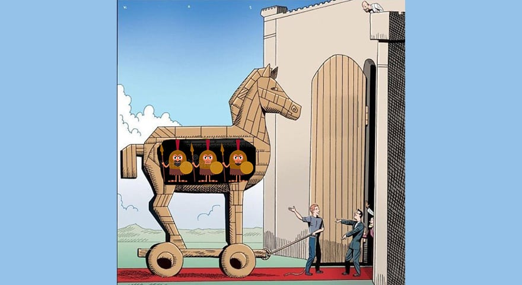

# CRYPTOPHUNKS


Nothing you see is official, everything is contribution. No devs, No roadmaps, No bs.\
Just Phunk Pham building cool stuff cause they care about web3 and decentralisation.


## Phunk is Punk

CryptoPhunks (Phunks) is a [Non-Fungible Token](https://en.wikipedia.org/wiki/Non-fungible\_token) (NFT) collection on the [Ethereum](https://en.wikipedia.org/wiki/Ethereum) [blockchain](https://en.wikipedia.org/wiki/Blockchain). The project was created in June 2021 by a group of [anonymous](https://twitter.com/CryptoPhunks) developers to poke fun at the high-brow, pompous group of people that were reflecting the “old-school” rules of art into this new frontier of NFTs. \
In July 2021, after receiving [DMCA](https://twitter.com/CryptoPhunks/status/1415001685986922499?s=20\&t=YRRn6i6uXhGV5Cgl\_pJeQA) served by [LarvaLabs](https://larvalabs.com) for copyright infringement, biggest NFT trading platform [OpenSea](https://opensea.io/assets/0xf07468ead8cf26c752c676e43c814fee9c8cf402/8348) censored and banned the collection from their platform for the third and final time. Shortly after, original developers compiled [Open Letter](https://foundation.app/@cryptophunks/foundation/62017) to LarvaLabs and left the project since.\
In a Spirit of web3 culture a renegade group of community builders took it upon themselves to create their own Phunk marketplace called [NotLarvaLabs](nll/notlarvalabs/) and [open-source](resources/open-sourced.md) the code.

.png>)


CryptoPhunks are the same as <mark style="color:green;"></mark> [CryptoPunks](https://www.larvalabs.com/cryptopunks) just flipped the other way.


## Phunk is web3

Phunks stand for decentralisation, censorship resistance, [public good](https://cryptonews.com/videos/funding-the-commons-funding-public-goods-algorithms-and-mechanisms.htm), for the people and for the freedom. CryptoPhunks are free-use, public domain Art, run entirely by decentralized community of artist and [builders](resources/open-sourced.md).\
They are important part of NFT history that raised so many important questions and [endless discussions](social-media/media/threads.md) around ownership, copyright, conceptual art, [CC0](https://creativecommons.org/publicdomain/zero/1.0/deed.en), blockchain provenance, touching on subjects like; Who decides what Art is? Do you really own your NFT?\
Phunks are challenging the status quo, they challenge power structures, for many people phunks symbolise anti-establishment, counter-culture and are know for their rebel Spirit :fist: constantly pushing the boundaries, taking whole NFT ecosystem to move in right direction of decentralisation, public good, ownership and censorship resistance.


In times when [VCs](https://www.investopedia.com/terms/v/venturecapitalist.asp) and Big Corporations are [entering web3](https://metaversal.banklesshq.com/p/bored-apes-cryptopunks-the-big-ideas?s=r) to claim ownership over your NFTs, CryptoPhunks are more relevant than ever to stand against centralisation in this emerging Crypto evolution where decentralisation should be paramount above all.



## Phunk is historic

✔️ They are the first and only project to be delisted from OpenSea 3 times.&#x20;

✔️ They are the first project to be DMCA'd by LarvaLabs.&#x20;

✔️ They are the first derivative project to build a zero-fee marketplace.

✔️ They are the second project ever to create a zero-fee marketplace.&#x20;

✔️ Phunks are a community of smart, talented, rebellious artists and [builders](resources/open-sourced.md).&#x20;

✔️ They are passionate about decentralisation and passionately against censorship.


An object's history is an immutable if intangible part of its value.


