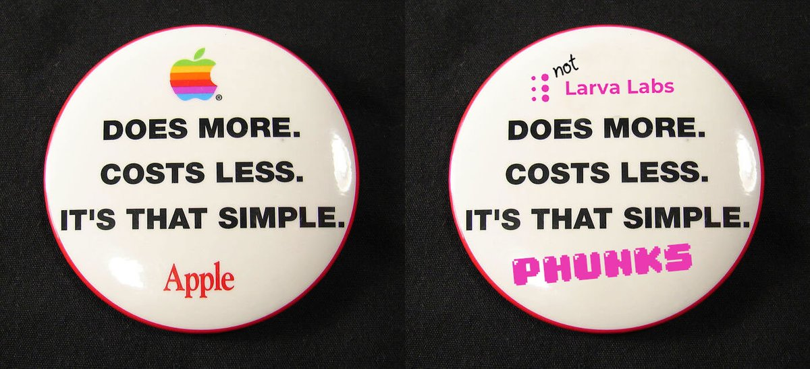

# ▫ ABOUT

## What is NotLarvaLabs?

[NotLarvaLabs](https://twitter.com/NotLarvaLabs) (NLL) is a community built royalty-free Marketplace for buying and selling CryptoPhunks, built on top of it's own custom [smart contract](https://etherscan.io/address/0xd6c037bE7FA60587e174db7A6710f7635d2971e7#code) with 0% trading fees.

Idea came to life after two Big Corporations (LarvaLabs and OpenSea) decided to [censor](https://twitter.com/CryptoPhunks/status/1415001685986922499?s=20\&t=zjOQE\_RXmdF6MuXAK4lCcg) CryptoPhunks. Coined and designed by [Pauly](https://twitter.com/Pauly0x) & [Ryder Ripps](https://twitter.com/ryder\_ripps) somewhere in LA and developed by [Chopper](https://twitter.com/chopper\_\_dad) and [Kenobi](https://twitter.com/OG\_Kenobi\_Hello) somewhere in NA, NLL quickly gained a lot of [attention](../../social-media/media/threads.md) in NFT world and flipped the script.

NLL developers decided to [open-source](https://github.com/Crypto-Phunks/CryptoPhunksMarket) the code and renounce the [ownership](https://twitter.com/NotLarvaLabs/status/1503576060448985089?s=20\&t=Tbap3ogy88gjcQXn\_DGRYQ), this means that Phunks Marketplace (backend) operates autonomously on Ethereum blockchain forever.\
Code has been [audited](https://github.com/Crypto-Phunks/CryptoPhunksMarket/blob/main/zMarketplaceAudit.pdf) by several developers, [documented](https://github.com/Crypto-Phunks/CryptoPhunksMarket/blob/main/zMarketplaceAudit.pdf) by Solidity developer [@t\_snark](https://twitter.com/t\_snark).

You can find source code [here](../../resources/links.md#smart-contract) to review or to fork it.


WEBSITE

