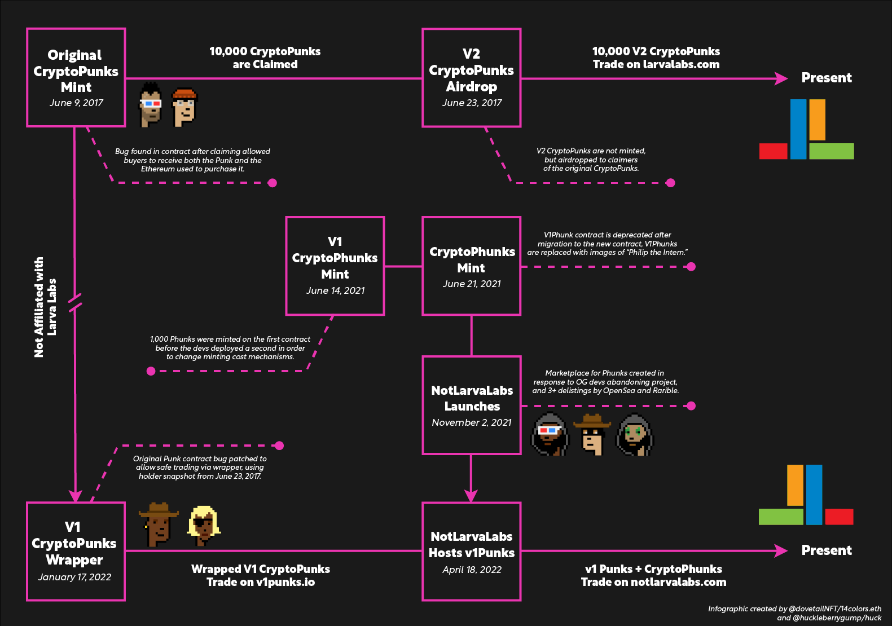

# HISTORY

June 23, 2017 

* [LarvaLabs](https://twitter.com/larvalabs) Launches CryptoPunks

June 14, 2021

* Initial CryptoPhunks Mint - V1\
  [Etherscan](https://etherscan.io/tx/0x48db643b9ee37de131e23456ecf35c3a270cba12b4e952f02fe7e5af0bb2a0cc)

June 21, 2021

* Migrated to v2 Contract - V1 Contract Deprecated\
  [Etherscan](https://etherscan.io/tx/0x994a30d91c09ecf14aef8fe42140742584762d3522a2016bd386361e6d76d4e2)
* OpenSea Delisting #1
* Original Developers Send Letter to LarvaLabs\
  [Tweet](https://twitter.com/cryptophunks/status/1407183012781903876?s=21)

June 24, 2021

* OpenSea Relisting #1
* Changed name to "Not a Punk" and added Rarity borders to appease OpenSea\
  [Tweet](https://twitter.com/cryptophunks/status/1408082776213966850?s=21)
* [Ryder Ripps](https://twitter.com/ryder_ripps) Mints CryptoPunk #3100 on Foundation - Sold for 2.2 ETH\
  [Etherscan](https://etherscan.io/tx/0x860c4012197ed2952ec00087bde974e58d674849f9f574b852430ed6b90a5572)

June 29, 2021

* OpenSea Delisting #2\
  [Discord](https://discord.com/channels/840362318033846333/840362318033846336/859457427900334090)

June 31, 2021

* [Ryder Ripps](https://twitter.com/ryder_ripps) Receives first DMCA ever from Larva Labs.

July 02, 2021

* CryptoPhunks Sell Out! All 10,000 Phunks minted.
* 621 unique holders at sell out

July 03, 2021

* OpenSea Relisting #2\
  [Tweet](https://twitter.com/natechastain/status/1411442112462266371?s=20)

July 13, 2021

* OpenSea Delisting #3
* LarvaLabs [DMCA’s](https://twitter.com/CryptoPhunks/status/1415001685986922499?s=20\&t=yStTw92XA4d6Ay79jauP_w) CryptoPhunks - First project to receive DMCA from LL

July 14, 2021

* Rarible Delisting

July 16, 2021

* Rarible Relisting\
  [Discord](https://discord.com/channels/840362318033846333/840362318033846336/865447175738621972)

July 20, 2021

* Foundation Letter to LarvaLabs, Devs leave project. Unwilling to counter DMCA.\
  [Foundation.app](https://foundation.app/@cryptophunks/~/62017)
* Removed "Not a Punk" naming
* Added Phunk images to IPFS\
  [Discord](https://discord.com/channels/840362318033846333/853364785041899520/867075927984570388)

September 14, 2021

* Nate Chastain Resigns from OpenSea after caught insider trading\
  [Tweet](http://twitter.com/TAYL0RWTF/status/1437935051065348099?s=20)

November 02, 2021

* Launch of [NotLarvaLabs.com](https://twitter.com/NotLarvaLabs)

November 04, 2021

* Record Breaking Alien Phunk Sale for 31 ETH ($140,000)\
  [Tweet](https://twitter.com/phunkbot/status/1456316441012187145?s=21)

November 12, 2021

* Record Breaking Ape Phunk Sale for 21.69 ETH ($100,000)\
  [Tweet](https://twitter.com/phunkbot/status/1459110126581956615?s=21)

November 16, 2021

* Record Breaking Alien Phunk Sale for 40 ETH ($167,000)\
  [Tweet](https://twitter.com/PhunkBot/status/1460777119559077894)

December 09, 2021

* Record Breaking Alien Phunk Sale for 97.0 ETH ($421,193)\
  [Tweet](https://twitter.com/NotLarvaLabs/status/1468931193584246786?s=20\&t=DXnunJPLzRcUlrPllVT_TQ)

March 13, 2022

* LarvaLabs sells Punks and Meebits IP to [YugaLabs](https://twitter.com/yugalabs)\
  [Tweet](https://twitter.com/larvalabs/status/1502421713153318918?s=20\&t=yStTw92XA4d6Ay79jauP_w)

April 13, 2022

* OpenSea Relisting #3\
  [Tweet](https://twitter.com/Kenogas/status/1514314569828614150?s=20\&t=xmeRflETillDBGwkz9-5Hw)

May 09, 2022

* ZAGABOND revealed as original creator of CryptoPhunks\
  [Tweet](https://twitter.com/ZAGABOND/status/1523775812893249537?s=20\&t=9FJzoCTVPshV4XD6Z-O0Fg)

May 12, 2022

* CryptoPhunks community regains custody over the Smart Contract\
  [Tweet](https://twitter.com/NotLarvaLabs/status/1524597159051550721?s=20\&t=9FJzoCTVPshV4XD6Z-O0Fg)

May 31, 2022

* CryptoPhunks are now Verified collection at OpenSea marketplace\
  [Tweet](https://twitter.com/Jclineshow/status/1531646769922068480?s=20\&t=9FJzoCTVPshV4XD6Z-O0Fg)

July 27, 2022

* Phunks Auction House goes Live\
  [Tweet](https://twitter.com/0x_hodl/status/1552346604106985474?s=20\&t=9FJzoCTVPshV4XD6Z-O0Fg)

August 15, 2022

* YugaLabs officially releases Licence Terms for CryptoPunks\
  [Tweet](https://twitter.com/cryptopunksnfts/status/1559284220442320897?s=20\&t=w_e25GoThGud6Zcz04vdPQ)

August 15, 2022

* CryptoPhunks community regains custody over the cryptophunks.com Domain\
  [Tweet](https://twitter.com/CryptoPhunksV2/status/1559308830823092233?s=20\&t=eP3I24L7vPvAzi3vuiI1TA)

September 27, 2022 

* CryptoPhunks Smart Contract gets blue Verified Checkmark [@etherscan](https://twitter.com/etherscan) \
  [Tweet](https://twitter.com/iape_/status/1574726012381839360?s=20\&t=X041d5lqfTPMlwTNW5tuJA)

