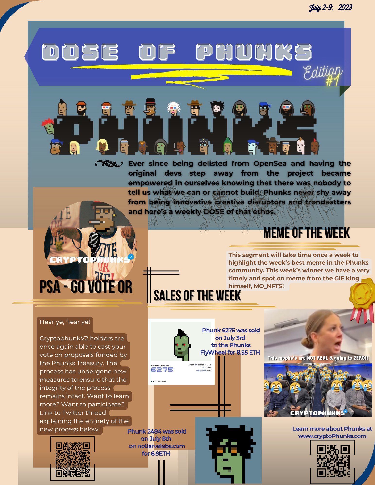
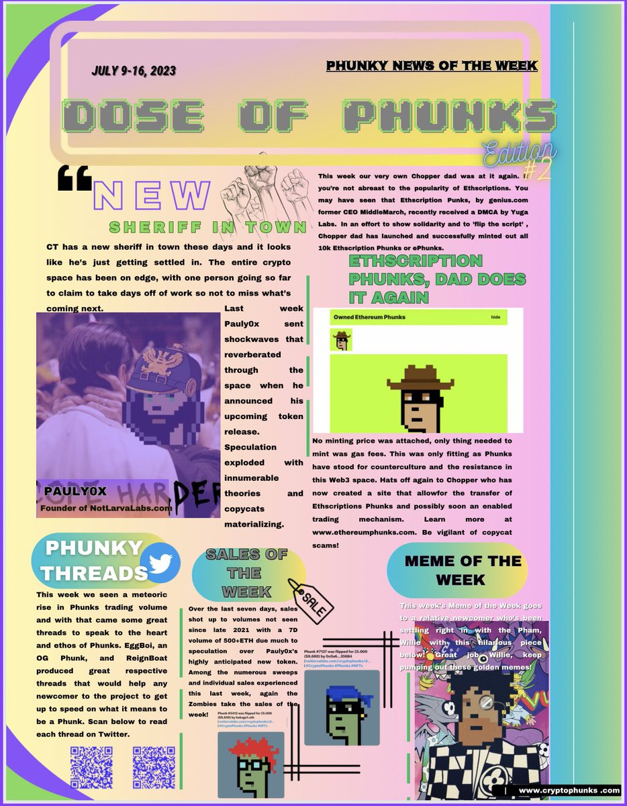
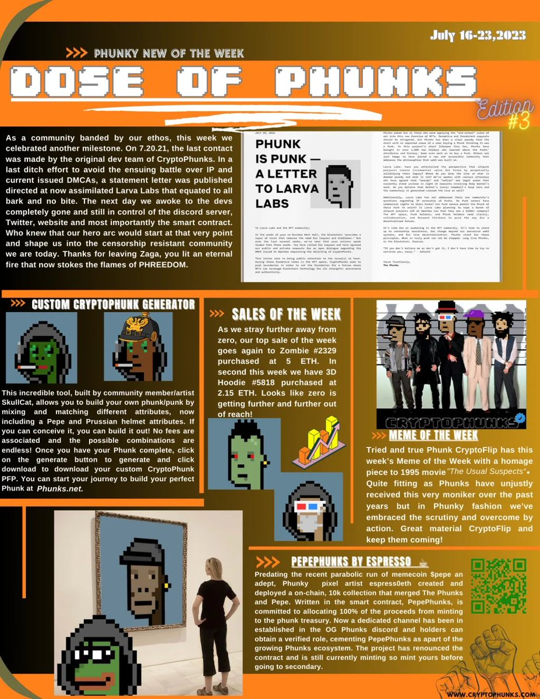
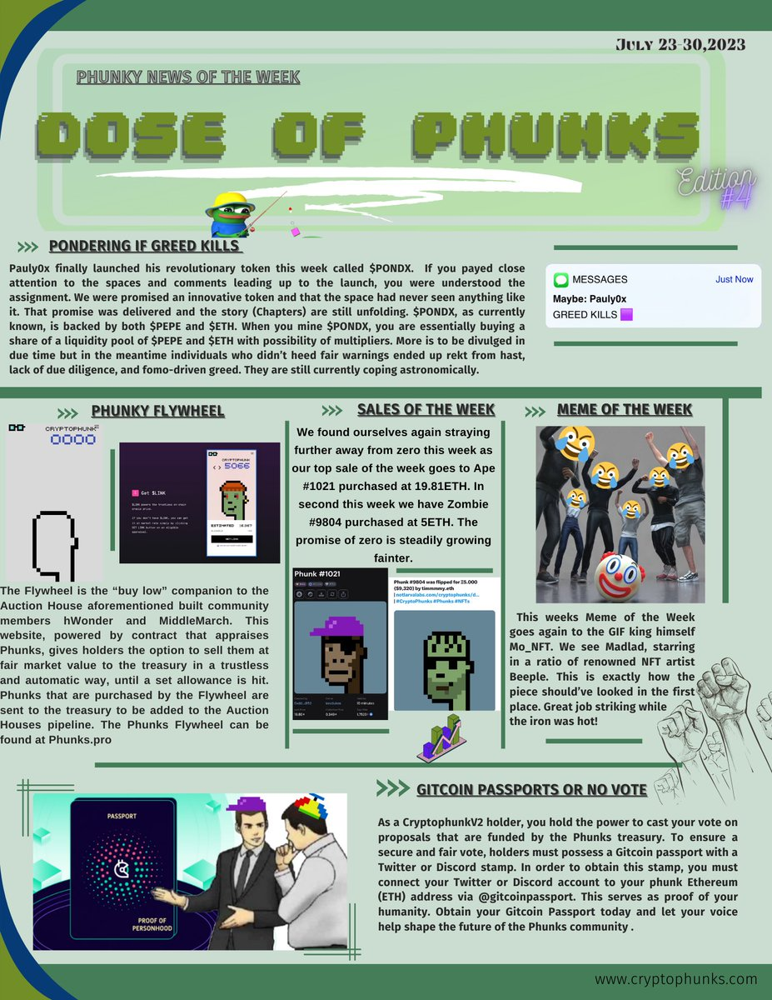

# 📰 DOSE OF PHUNKS

## EDITION #1

<figure><figcaption>
<a href="https://twitter.com/NfTenchi/status/1678209496336805888?s=20"><strong>JULY 02-09, 2023</strong></a>
</figcaption></figure>

## EDITION #2

<figure><figcaption>
<a href="https://twitter.com/NfTenchi/status/1681723668924121103?s=20"><strong>JULY 09-16, 2023</strong></a>
</figcaption></figure>

## EDITION #3

<figure><figcaption>
<a href="https://twitter.com/NfTenchi/status/1683483915984535554?s=20"><strong>JULY 16-23, 2023</strong></a>
</figcaption></figure>

## EDITION #4

<figure><figcaption>
<a href="https://twitter.com/NfTenchi/status/1686340561282711552?s=20"><strong>JULY 23-30, 2023</strong></a>
</figcaption></figure>
