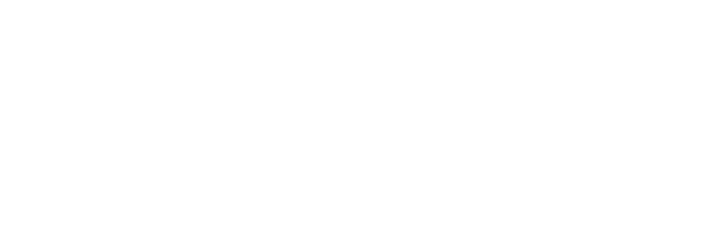
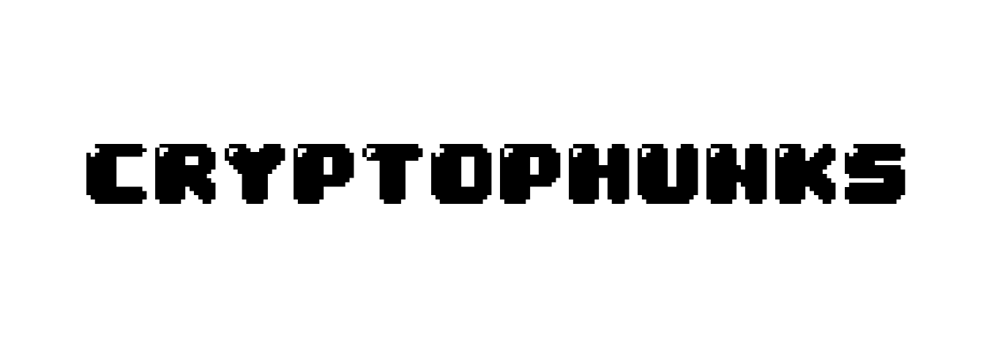
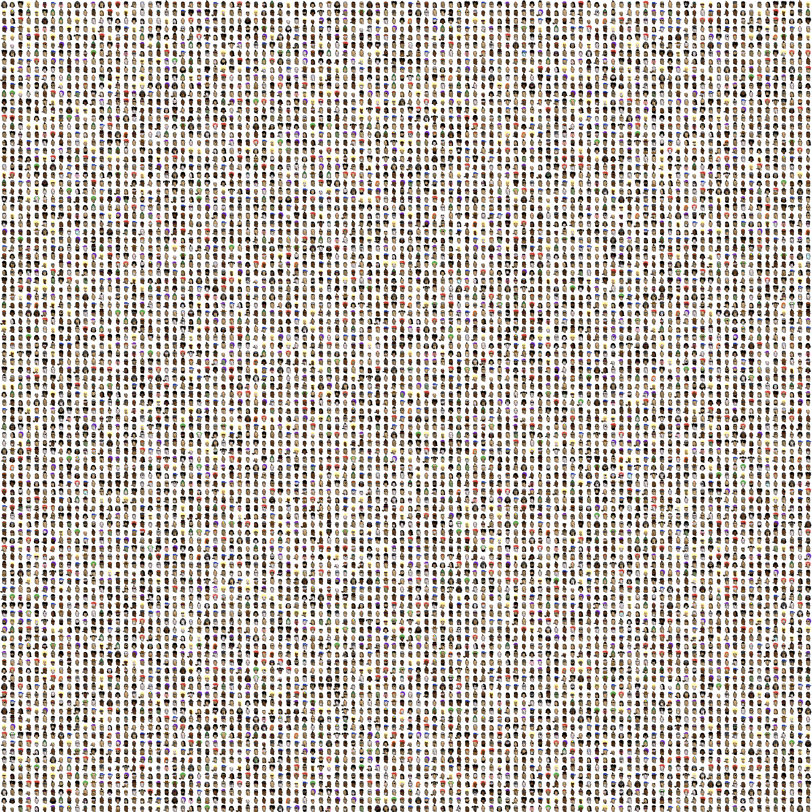

# ▫ MEDIA KIT

## Phunks Font Style


<details>

<summary>DOWNLOAD 04b_30 FONT</summary>

[https://dl.dafont.com/dl/?f=04b\_30](https://dl.dafont.com/dl/?f=04b\_30)

</details>

## Transparent Phunks PNG





## CryptoPhunk Viewer

Start by clicking on "Run Pen", change scale to 0.25x for compact preview and enter your Phunk ID.\
You can also change background colour by choosing one below, download will only extract phunk not the background. You can always zoom in and screenshot it.&#x20;


**PHUNK VIEWER**



**For Phunk Custom PFP (Profile Picture) use** [**Phunk Box**](../../nll/notlarvalabs/tutorials.md#tutorials) **by** [**NotLarvaLabs**](../../nll/notlarvalabs/)**.**


## Phunk Collage

All 10'000 Phunks in one Collage. When viewed locally on your PC, this collage is very scalable. \
Just Right Click and Save, then zoom in to the max.



## Download All

Here is tutorial how to download all 10'000 Phunks **each as a separate jpeg** in one instance, each Phunks is saved with Phunk #ID in 24x24 and in 192x192 (8x) format.


[OG POST](https://old.reddit.com/r/CryptoPunksDev/comments/s4hyny/q\_how\_can\_i\_generate\_10\_000\_leftlooking\_phunks\_in/) by [@geraldbauer](https://twitter.com/geraldbauer)


Change the loop in the [phunks script](https://github.com/cryptopunksnotdead/cryptopunks/blob/master/phunks/phunks.rb) from:

```
punks.each do |punk|
  phunks << punk.mirror    #¹ 
end
```

to save the phunks one-by-one in 24x24 and in 192x192 (with 8x zoom) try:

```
punks.each_with_index do |punk,i| phunk = punk.mirror
  phunk.save( "phunk-#{i}.png" ) 
  phunk.zoom(8).save( "phunk-#{i}@8x.png" )
  phunks << phunk ## add to composite
end 
```

(Re)run the script and voila - you will get 20 000 phunk images in two series in the 24x24 and 192x192 (with 8x zoom) format e.g. `phunk-0.png`, `phunk-0@8x.png`, `phunk-1.png`, `phunk-1@8x.png`, and so on.

[Questions and comments are welcome.](https://old.reddit.com/r/CryptoPunksDev/comments/s4hyny/q\_how\_can\_i\_generate\_10\_000\_leftlooking\_phunks\_in/)

Ruby script [phunk.rb](https://github.com/cryptopunksnotdead/cryptopunks/blob/master/phunks/phunks.rb)

```
###########
#   Phree the Phunks!
#
#  to run use:
#    ruby ./phunks.rb


require 'pixelart'


## read in right-facing punk composite
print "==> loading right-facing image..."
punks = ImageComposite.read( "../../awesome-24px/collection/punks.png" )
print "OK\n"


## 100x100 = 10 000 punks (cols x rows); create an empty composite
##    phunk with background (use solid blue-ish color for now)
phunks = ImageComposite.new( 100, 100, background: '#638596' )

punks.each do |punk|
  phunks << punk.mirror   ## mirror, that is, flip image vertically (right-facing to left-facing)
end


print "==> saving left-facing image..."
phunks.save( "./tmp/phunks.png" )
print "OK\n"


puts "bye"
```

## Phunks in Poster size (1200x1200)

Phunk enthusiast, amazing developer and [@Genius](https://twitter.com/Genius) co-founder [Middlemarch](https://twitter.com/dumbnamenumbers) made an effort to upload All 10'000 Phunks to [IPFS](https://ipfs.io/) in HQ 1200x1200 pixel Poster Size images.

To download specific Phunk in HQ, copy link below and change Phunk #ID to the Phunk you desire at the end of the URL + **.png** extension.&#x20;

```
https://middlemarch.mypinata.cloud/ipfs/QmcvdPd7Jai74e595Mgx2u6D8QZZ1TGSFC2EQQNayQVJL8/8348.png
```

To download All 10'000 Phunks in 1200x1200 pixel Poster Size use this link below, this needs to be done from command line (cmd). Due to IPFS restrictions in bandwidth you can only download 10 phunks at once. Repeat the steps until you have all 10'000 Phunks.&#x20;

```
seq 0 9999 | xargs -n1 -P10 bash -c 'i=$0; url="https://middlemarch.mypinata.cloud/ipfs/QmcvdPd7Jai74e595Mgx2u6D8QZZ1TGSFC2EQQNayQVJL8/${i}.png"; curl -O -s $url'
```

or you can use this link to download All 10'000 Phunks in 1200x1200 pixel zipped.

```
https://middlemarch.mypinata.cloud/ipfs/QmR4zNYDSLttz4VbTohU3bg7pf7CiDg6iMAbor2etQ4Hu1
```

Example Phunk #6993


****[**1200x1200**](https://middlemarch.mypinata.cloud/ipfs/QmcvdPd7Jai74e595Mgx2u6D8QZZ1TGSFC2EQQNayQVJL8/6993.png)****


## Transparent PNG of your Phunk

A little tool for you to download your phunks as transparent PNG images for your meme needs. Enter your phunk ID wait a couple of seconds to load and download. by [@TheSkullCat](https://twitter.com/TheSkullCat)


****[**TWEET**](https://twitter.com/TheSkullCat/status/1532501160866742288)****


## Generate your own custom Phunk

A little tool for you to generate your own custom Phunk. Go through available attributes, add them 1 by 1 and download. You can also download transparent attribute images for your meme needs. by [@TheSkullCat](https://twitter.com/TheSkullCat)


****[**TWEET**](https://twitter.com/TheSkullCat/status/1532754462284079104)****

