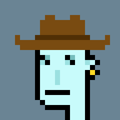
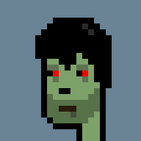
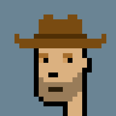
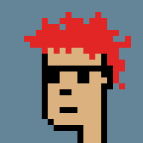
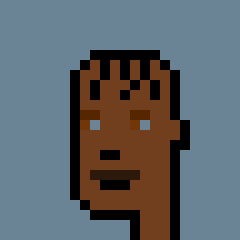
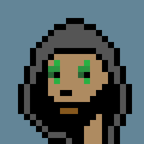
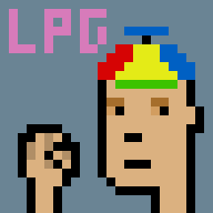
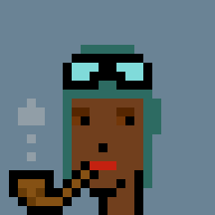
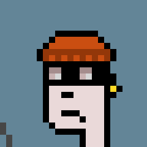

# 🔵 DOVETAIL

in no particular order, made by [@dovetailNFT](https://twitter.com/dovetailNFT)

 (2).png>)

 (2).png>)

 (1).png>)

.png>)

 (1).png>)

 (2).png>) (1).png>)\
[VAPORPHUNK in a 24x24 grid there is endless artistic potential](https://twitter.com/dovetailNFT/status/1513973443695415301?s=20\&t=TzictjlCH1fGYY7Ffrl1XQ)

 (1).png>)

 (2).png>)

 (3).png>).png>)\
[**who wore it better?**](https://twitter.com/dovetailNFT/status/1513928939567206416?s=20\&t=TzictjlCH1fGYY7Ffrl1XQ)

 (1) (1).png>).png>)\
[painted punk/phunk 3065 this weekend.](https://twitter.com/dovetailNFT/status/1516043898174554122?s=20\&t=TzictjlCH1fGYY7Ffrl1XQ)

 (1).png>)

 (2).png>)

 (1).png>)

 (1) (2).png>)

 (1).png>) (1).png>)\
[14 colors](https://twitter.com/dovetailNFT/status/1513945866415058948?s=20\&t=TzictjlCH1fGYY7Ffrl1XQ)

 (1) (2).png>) (1) (1).png>)\
[14colors.eth](https://twitter.com/dovetailNFT/status/1512099861608476680?s=20\&t=TzictjlCH1fGYY7Ffrl1XQ)

 (1).png>)

 (1).png>)

.png>)

 (1).png>)

 (1).png>)

 (1).png>).png>).png>) (1) (1).png>)[**dark mode: on**](https://twitter.com/dovetailNFT/status/1513615245650153474?s=20\&t=TzictjlCH1fGYY7Ffrl1XQ)

 (1).png>).png>)\
phunk mondrian (dovetail, 2022) inspired by [@PhunkyVasilios](https://twitter.com/PhunkyVasilios) and [@piv\_piv](https://twitter.com/piv\_piv)

 (1).png>)

 (1).png>) (1).png>) (1).png>)\
[experimenting with creating new traits](https://twitter.com/dovetailNFT/status/1513198697542205442?s=20\&t=TzictjlCH1fGYY7Ffrl1XQ)

 (1).png>)

 (2).png>)

 (2).png>)

 (1) (1).png>) (2).png>) (1).png>)\
[**gm**](https://twitter.com/dovetailNFT/status/1512807372858740744?s=20\&t=TzictjlCH1fGYY7Ffrl1XQ)

 (1).png>)

 (1).png>)

 (1).png>)

## **GIFS (**warning sensitive content)&#x20;

\
\
\
\
\
\
\
\
\
 (1) (1) (1).gif>)\
 (1) (1) (1) (1) (1).gif>)\
