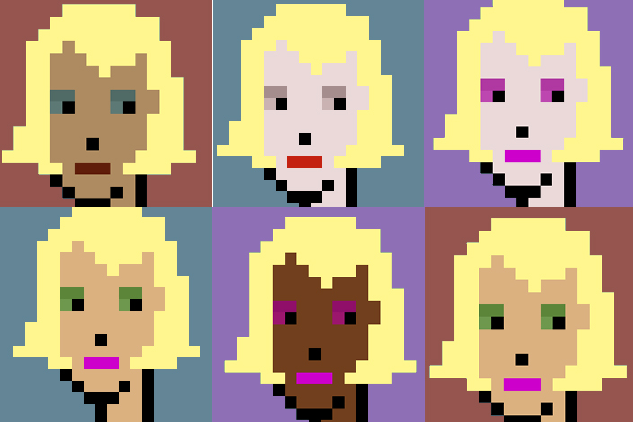

# ◽ PIV

.jpeg>)

 (1) (1) (1).png>) (1) (1).png>)

 (1) (1).png>) (1).png>)

 (1) (1).png>) (1) (1).png>)

 (1) (1).png>) (1) (1).png>)

 (1) (1).png>) (1).png>)

 (1).png>) (1).png>)

 (1).png>) (1).png>)

 (1) (1).png>) (1) (1) (1).png>)

 (1) (1).png>) (1).png>)

[Who wore it better?](https://twitter.com/piv\_piv/status/1480557710626197508?s=20\&t=\_lc0IEIuVeEzKlmIQy7CRw)

.png>).png>)\
[Who wore it better?](https://twitter.com/piv\_piv/status/1482360554614403078?s=20\&t=\_lc0IEIuVeEzKlmIQy7CRw)

 (1).png>)

 (1) (1).png>)

 (1) (1).png>)

 (1).png>)

.png>)

 (1).png>)

 (1).png>)

 (1).png>)

.png>)

.png>)

 (1).png>) (1).png>)\
[Suprematist composition with printscreens of Phunk 9517](https://twitter.com/piv\_piv/status/1489936771353878532?s=20\&t=\_lc0IEIuVeEzKlmIQy7CRw)

 (1).png>) (1).png>)\
[Suprematist Composition with Phunk Clown Nose](https://twitter.com/piv\_piv/status/1489358965947478016?s=20\&t=\_lc0IEIuVeEzKlmIQy7CRw)

.png>) (1).png>)\
[Abstract composition with Phunk clown nose and eye](https://twitter.com/piv\_piv/status/1488600582994771974?s=20\&t=\_lc0IEIuVeEzKlmIQy7CRw)

 (1).png>) (1).png>)\
[Composition with Phunk eye](https://twitter.com/piv\_piv/status/1488444186122674177?s=20\&t=\_lc0IEIuVeEzKlmIQy7CRw)

.png>).png>)\
[Man With a Movie Camera - Dziga Vertov](https://twitter.com/piv\_piv/status/1490605834216386565?s=20\&t=\_lc0IEIuVeEzKlmIQy7CRw)

.png>).png>)\
[Psycho](https://twitter.com/piv\_piv/status/1490658023714570245?s=20\&t=\_lc0IEIuVeEzKlmIQy7CRw)

.png>).png>)\
[Phunk](https://twitter.com/piv\_piv/status/1491506474136354818?s=20\&t=\_lc0IEIuVeEzKlmIQy7CRw)

 (1).png>) (1).png>)\
[The Blair Witch Project](https://twitter.com/piv\_piv/status/1490350495298424834?s=20\&t=\_lc0IEIuVeEzKlmIQy7CRw)

.png>).png>)\
[The Good, the Bad and the Ugly](https://twitter.com/piv\_piv/status/1490585694267453443?s=20\&t=\_lc0IEIuVeEzKlmIQy7CRw)

.png>).png>)\
[Le Fabuleux Destin d'Amélie Poulain](https://twitter.com/piv\_piv/status/1490590043202899970?s=20\&t=\_lc0IEIuVeEzKlmIQy7CRw)

.png>).png>)\
[Kill Bill](https://twitter.com/piv\_piv/status/1490595420787068928?s=20\&t=\_lc0IEIuVeEzKlmIQy7CRw)

.png>)\
[A Clockwork Orange](https://twitter.com/piv\_piv/status/1490602563246297089?s=20\&t=\_lc0IEIuVeEzKlmIQy7CRw)

.png>).png>)\
[OpenSea](https://twitter.com/piv\_piv/status/1495165873321041920?s=20\&t=\_lc0IEIuVeEzKlmIQy7CRw)

.png>).png>)\
[Pumpkins](https://twitter.com/piv\_piv/status/1495170092178550786?s=20\&t=\_lc0IEIuVeEzKlmIQy7CRw)

.png>).png>)\
[Phunk 0413 as Vegetable Seller](https://twitter.com/piv\_piv/status/1495464368863076353?s=20\&t=\_lc0IEIuVeEzKlmIQy7CRw)

.png>).png>)\
[Punk 324 holds a mirror next to her face Phunks](https://twitter.com/piv\_piv/status/1496110544297807878?s=20\&t=\_lc0IEIuVeEzKlmIQy7CRw)

.png>).png>)\
[Pointing mirror guy](https://twitter.com/piv\_piv/status/1496555252258156548?s=20\&t=\_lc0IEIuVeEzKlmIQy7CRw)

.png>).png>)\
[A Dictionary of P(h)unk Color Combinations](https://twitter.com/piv\_piv/status/1489586455685050373?s=20\&t=\_lc0IEIuVeEzKlmIQy7CRw)

 (1).png>)

