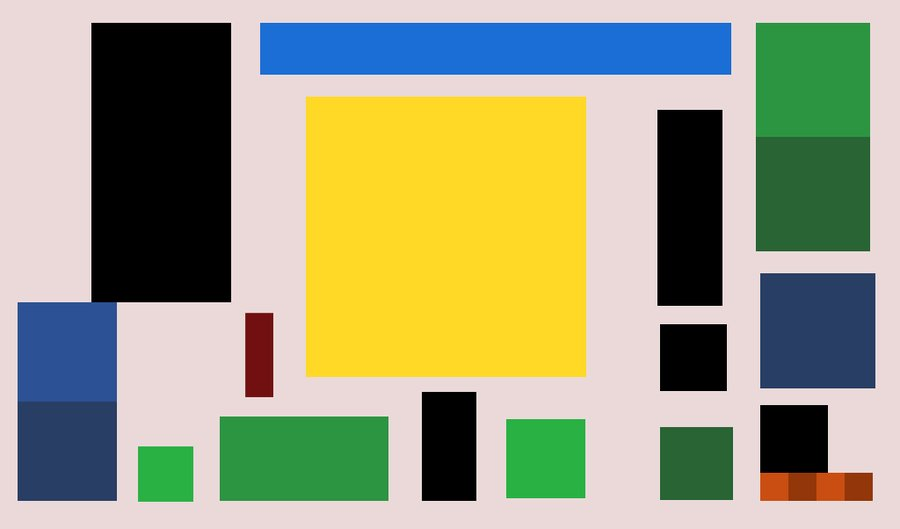
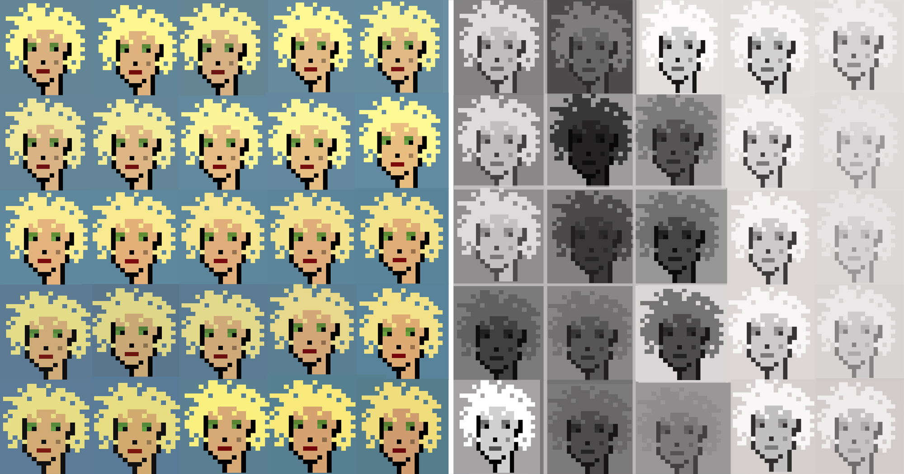
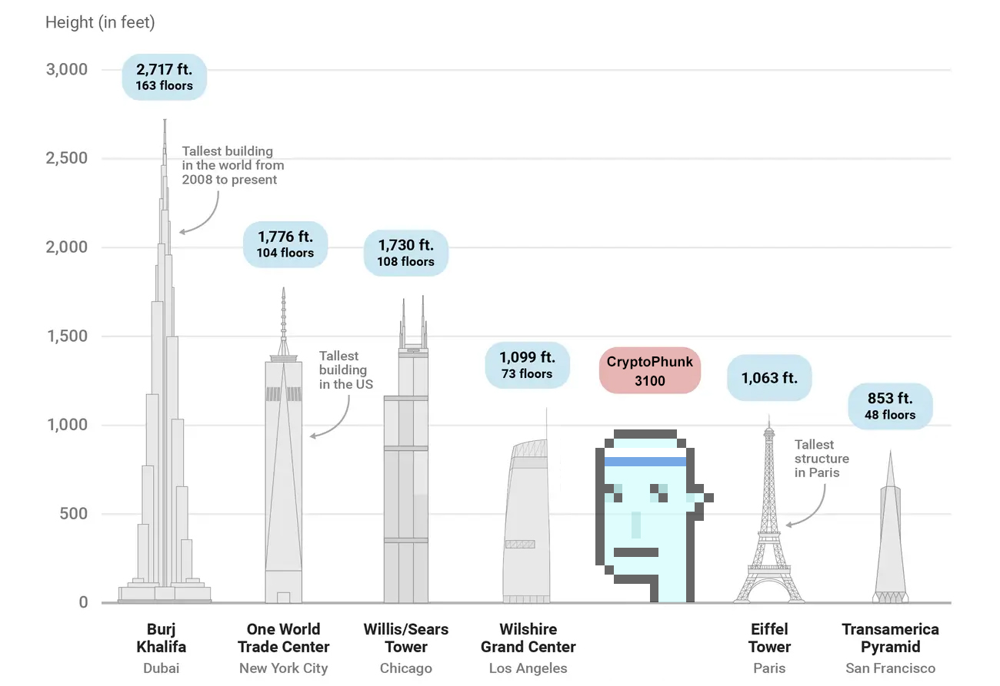

# 🔴 PIV

in no particular order, made by [@piv\_piv](https://twitter.com/piv\_piv)

.jpeg>)

.jpeg>)

 (1) (1) (1) (1) (1).png>) (1) (1) (1).png>)

 (1) (1) (1) (1) (1) (1).png>) (1) (1) (1).png>)

 (1) (1) (2) (1) (1) (1) (2).png>) (1) (1) (1) (1) (1).png>)

 (1) (1) (1) (1) (1).png>) (1) (1) (1) (1).png>)

 (1) (1) (1) (1) (1).png>) (1) (1).png>)

 (1) (1) (1) (1).png>) (1) (1) (1) (1).png>)

 (1) (1) (1).png>) (1) (1) (1).png>)

 (1) (1) (1) (1) (1).png>) (1) (1) (1) (1) (1) (1).png>)

 (1) (1) (1) (1) (1).png>) (1) (1) (1).png>)

[Who wore it better?](https://twitter.com/piv\_piv/status/1480557710626197508?s=20\&t=\_lc0IEIuVeEzKlmIQy7CRw)

.png>)

 (1).png>) (1) (1).png>)\
[Who wore it better?](https://twitter.com/piv\_piv/status/1517251273887731724?s=20\&t=\_lc0IEIuVeEzKlmIQy7CRw)

 (1).png>)

 (1) (1).png>) (1) (1) (1).png>)\
[Who wore it better?](https://twitter.com/piv\_piv/status/1482360554614403078?s=20\&t=\_lc0IEIuVeEzKlmIQy7CRw)

 (1).png>)

 (1) (1).png>)

 (1) (1) (1) (1).png>)

 (1) (1) (1) (1).png>)

 (1) (1) (1) (1) (1).png>)

 (1).png>)

 (1) (1) (1).png>)

 (1) (1) (1).png>)

 (1) (1) (1) (1).png>)

 (1) (1) (1) (1).png>)

 (1) (1) (1).png>)

 (1) (1) (1).png>)

 (1) (1) (1).png>) (1) (1) (1) (1).png>)\
[Suprematist composition with printscreens of Phunk 9517](https://twitter.com/piv\_piv/status/1489936771353878532?s=20\&t=\_lc0IEIuVeEzKlmIQy7CRw)

 (1) (1).png>)

 (1) (1) (1) (1).png>) (1) (1) (1) (1).png>)\
[Suprematist Composition with Phunk Clown Nose](https://twitter.com/piv\_piv/status/1489358965947478016?s=20\&t=\_lc0IEIuVeEzKlmIQy7CRw)

.png>)

 (1) (1) (1).png>) (1) (1) (1).png>)\
[Abstract composition with Phunk clown nose and eye](https://twitter.com/piv\_piv/status/1488600582994771974?s=20\&t=\_lc0IEIuVeEzKlmIQy7CRw)

 (1) (1) (1).png>)

 (1) (1) (1) (1).png>) (1) (1) (1) (1) (1).png>)\
[Composition with Phunk eye](https://twitter.com/piv\_piv/status/1488444186122674177?s=20\&t=\_lc0IEIuVeEzKlmIQy7CRw)

 (1) (1).png>) (1) (1) (1).png>)\
[Man With a Movie Camera - Dziga Vertov](https://twitter.com/piv\_piv/status/1490605834216386565?s=20\&t=\_lc0IEIuVeEzKlmIQy7CRw)

 (1) (1) (1).png>) (1).png>)\
[Left: Cropped CryptoPhunk 7258, background color edited on the website Right: Andy Warhol, Self-Portrait with Platinum Bouffant Wig, 1981](https://twitter.com/piv\_piv/status/1518902876831162368?s=20\&t=\_lc0IEIuVeEzKlmIQy7CRw)

.png>) (1).png>)\
[Left: Slightly rotated mole of Phunk 961 Right: Suprematist Composition: White on White by Kazimir Malevich, 1918](https://twitter.com/piv\_piv/status/1521542215675297795?s=20\&t=HU8S4njt6xZuu271JmK8PA)

 (1) (1).png>) (1) (1) (1).png>)\
[Psycho](https://twitter.com/piv\_piv/status/1490658023714570245?s=20\&t=\_lc0IEIuVeEzKlmIQy7CRw)

 (1) (1) (1) (1).png>) (1) (1).png>)\
[Phunk](https://twitter.com/piv\_piv/status/1491506474136354818?s=20\&t=\_lc0IEIuVeEzKlmIQy7CRw)

 (1).png>)

.png>)

 (1) (1) (1).png>) (1) (1) (1) (1).png>)\
[The Blair Witch Project](https://twitter.com/piv\_piv/status/1490350495298424834?s=20\&t=\_lc0IEIuVeEzKlmIQy7CRw)

.png>) (1).png>)\
[After Man Ray - made with two printscreens, one of Phunk 118 and one of Punk 658.](https://twitter.com/piv\_piv/status/1510325291075440651?s=20\&t=\_lc0IEIuVeEzKlmIQy7CRw)

 (1).png>) (1) (1).png>) (1).png>) (1).png>)\
.png>).png>)\
[Andy. Original pictures by Duane Michals.](https://twitter.com/piv\_piv/status/1518894768511754242?s=20\&t=\_lc0IEIuVeEzKlmIQy7CRw)

 (1) (1).png>) (1) (1) (1).png>)\
[The Good, the Bad and the Ugly](https://twitter.com/piv\_piv/status/1490585694267453443?s=20\&t=\_lc0IEIuVeEzKlmIQy7CRw)

 (1) (1).png>)

 (1) (1).png>) (1) (1).png>)\
[After 'Glass Tears' by Man Ray (update) Man Ray used small glass beads as tears so I used the color of glass (glasses) from the Phunks for the tears.](https://twitter.com/piv\_piv/status/1510333204913348613?s=20\&t=\_lc0IEIuVeEzKlmIQy7CRw)

 (1) (1).png>) (1) (1).png>)\
[Le Fabuleux Destin d'Amélie Poulain](https://twitter.com/piv\_piv/status/1490590043202899970?s=20\&t=\_lc0IEIuVeEzKlmIQy7CRw)

.png>)

 (1) (1) (1).png>) (1) (1) (1).png>)\
[Kill Bill](https://twitter.com/piv\_piv/status/1490595420787068928?s=20\&t=\_lc0IEIuVeEzKlmIQy7CRw)

 (1) (1) (1).png>) (2).png>)\
[A Clockwork Orange](https://twitter.com/piv\_piv/status/1490602563246297089?s=20\&t=\_lc0IEIuVeEzKlmIQy7CRw)

 (1) (1).png>) (1).png>)\
[Punk and Phunks skiing down a mountain](https://twitter.com/piv\_piv/status/1517955570879369218?s=20\&t=\_lc0IEIuVeEzKlmIQy7CRw)

 (1) (1).png>) (1) (1) (1).png>)\
[A Clockwork Orange](https://twitter.com/piv\_piv/status/1497476983537774594?s=20\&t=\_lc0IEIuVeEzKlmIQy7CRw)

.png>)

 (1) (1).png>)

 (1) (1).png>)

 (1) (1) (1) (1).png>) (1) (1).png>)\
[OpenSea](https://twitter.com/piv\_piv/status/1495165873321041920?s=20\&t=\_lc0IEIuVeEzKlmIQy7CRw)

 (1).png>) (1) (1).png>)\
[Phumpkins](https://twitter.com/piv\_piv/status/1495170092178550786?s=20\&t=\_lc0IEIuVeEzKlmIQy7CRw)

 (1).png>) (1) (1).png>)\
[Phunk 0413 as Vegetable Seller](https://twitter.com/piv\_piv/status/1495464368863076353?s=20\&t=\_lc0IEIuVeEzKlmIQy7CRw)

 (1) (1) (1).png>) (1) (1) (1) (1).png>)\
[Punk 324 holds a mirror next to her face Phunks](https://twitter.com/piv\_piv/status/1496110544297807878?s=20\&t=\_lc0IEIuVeEzKlmIQy7CRw)

 (1) (1) (1).png>) (1) (1) (1).png>)\
[Pointing mirror guy](https://twitter.com/piv\_piv/status/1496555252258156548?s=20\&t=\_lc0IEIuVeEzKlmIQy7CRw)

 (1) (1) (1).png>) (1) (2).png>)\
[Picasso, Villa Californie, CANNES , c.1953 by André Villers](https://twitter.com/piv\_piv/status/1507744395302522880?s=20\&t=\_lc0IEIuVeEzKlmIQy7CRw)

 (1) (1) (1).png>) (1).png>)\
[Picasso’s Eyes, 1957 by David Douglas Duncan](https://twitter.com/piv\_piv/status/1508009942191534083?s=20\&t=\_lc0IEIuVeEzKlmIQy7CRw)

 (1) (1).png>) (1) (1) (1).png>)\
[Jan van Eyck Phunk](https://twitter.com/piv\_piv/status/1496919620351103001?s=20\&t=\_lc0IEIuVeEzKlmIQy7CRw)

 (1) (1).png>)

 (1) (1).png>) (1) (1).png>)\
[Self Portrait with Masks, 1899 James Ensor](https://twitter.com/piv\_piv/status/1497622640202326023?s=20\&t=\_lc0IEIuVeEzKlmIQy7CRw)

 (1) (1) (1).png>) (1) (1) (1).png>)\
[Group Portrait of the Amsterdam Shooting Corporation, 1532 by Dirck Jacobsz](https://twitter.com/piv\_piv/status/1498545174540169216?s=20\&t=\_lc0IEIuVeEzKlmIQy7CRw)

 (1) (1) (1).png>)

 (1) (1).png>)

 (1) (1) (1).png>) (1).png>)\
[Three-headed Christ](https://twitter.com/piv\_piv/status/1499074812391657472?s=20\&t=\_lc0IEIuVeEzKlmIQy7CRw)

 (1) (1).png>) (1) (1).png>)\
[Where's the Phunk? -after 'Where's Wally?'](https://twitter.com/piv\_piv/status/1498940034208120833?s=20\&t=\_lc0IEIuVeEzKlmIQy7CRw)

 (2).png>)

.png>) (1) (1).png>)\
[Albert Einstein](https://twitter.com/piv\_piv/status/1500893678910464000?s=20\&t=\_lc0IEIuVeEzKlmIQy7CRw)

 (1).png>).png>)\
[the Chad](https://twitter.com/piv\_piv/status/1501227834961915904?s=20\&t=\_lc0IEIuVeEzKlmIQy7CRw)

 (1).png>)

 (1).png>)

 (1) (1).png>)

 (1) (1).png>)

 (1) (1) (1).png>) (1).png>) (1).png>)[Groucho Marx attribute](https://twitter.com/piv\_piv/status/1505490698405036034?s=20\&t=\_lc0IEIuVeEzKlmIQy7CRw)

 (1) (1).png>)

 (1).png>) (1) (1) (1).png>)\
[Who wore it better? Scrambled Phunk pixels vs. 4900 Colours (Gerhard Richter)](https://twitter.com/piv\_piv/status/1509816169208946689?s=20\&t=\_lc0IEIuVeEzKlmIQy7CRw)

 (1) (1).png>)

 (1) (1).png>)

 (1) (1).png>) (1) (1) (1).png>)\
[Two suprematist compositions with Phunk parts](https://twitter.com/piv\_piv/status/1511417747191865348?s=20\&t=\_lc0IEIuVeEzKlmIQy7CRw)

 (1) (1) (1).png>)

 (1) (1).png>)

 (1) (1).png>)

 (1) (1) (1).png>) (1) (1) (1).png>)\
[A Dictionary of P(h)unk Color Combinations](https://twitter.com/piv\_piv/status/1489586455685050373?s=20\&t=\_lc0IEIuVeEzKlmIQy7CRw)

 (1) (1) (1) (1) (1).png>)

 (1).png>) (1).png>)\
[Left: Phunks & Punks with shading Right: Salome with the Head of John the Baptist by Caravaggio, 1607.](https://twitter.com/piv\_piv/status/1519638417784647680?s=20\&t=TzictjlCH1fGYY7Ffrl1XQ)
